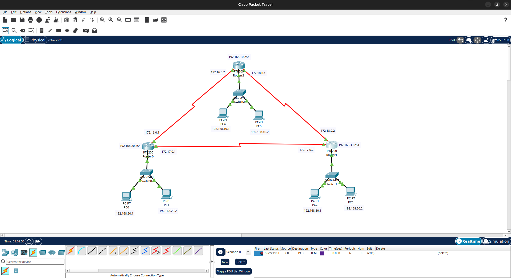

# 📌 Lab 02 - RIP Routing

## Objective

Configure dynamic routing using RIPv2 between three different LANs connected using three Cisco routers.

---

## Network Topology



---

## Devices Used

- 3 Cisco Routers
- 3 Cisco Switches
- 6 PCs

---

## IP Addressing

### LAN 10

| Device  | IP Address     | Default Gateway |
|---------|----------------|-----------------|
| Router2 | 192.168.10.254 | -               |
| PC4     | 192.168.10.1   | 192.168.10.254  |
| PC5     | 192.168.10.2   | 192.168.10.254  |

---

### LAN 20

| Device  | IP Address     | Default Gateway |
|---------|----------------|-----------------|
| Router0 | 192.168.20.254 | -               |
| PC0     | 192.168.20.1   | 192.168.20.254  |
| PC1     | 192.168.20.2   | 192.168.20.254  |

---

### LAN 30

| Device  | IP Address     | Default Gateway |
|---------|----------------|-----------------|
| Router1 | 192.168.30.254 | -               |
| PC2     | 192.168.30.1   | 192.168.30.254  |
| PC3     | 192.168.30.2   | 192.168.30.254  |

---

### Router-to-Router Links

| Connection | Router  | Interface | IP Address |
|------------|---------|-----------|------------|
| R0 ↔ R2    | Router0 | Serial1/0 | 172.16.0.1 |
| R0 ↔ R2    | Router2 | Serial1/0 | 172.16.0.2 |
| R0 ↔ R1    | Router0 | Serial1/1 | 172.17.0.1 |
| R0 ↔ R1    | Router1 | Serial1/1 | 172.17.0.2 |
| R2 ↔ R1    | Router2 | Serial1/1 | 172.18.0.1 |
| R2 ↔ R1    | Router1 | Serial1/0 | 172.18.0.2 |

**Subnet Mask**

```text
255.255.0.0
