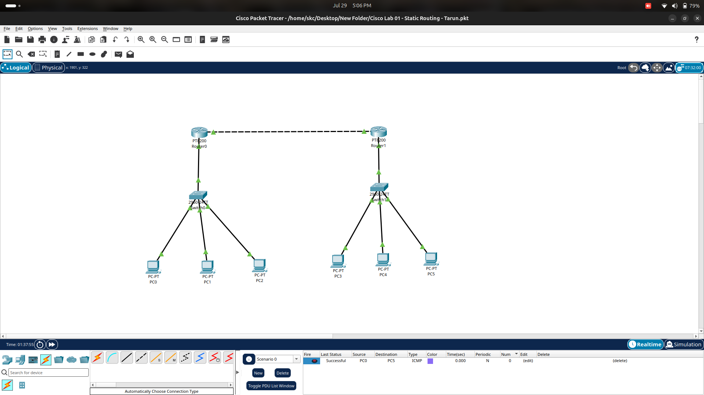

# 🚀 Cisco Packet Tracer Labs

## 📌 Lab 01 - Static Routing

This is my first Cisco Packet Tracer networking project, demonstrating static routing between two LANs connected through two routers.

---

# 🖼️ Network Topology



---

# 📖 Project Overview

This project simulates communication between two different networks using static routing.

### Network Devices

- 🛜 2 Routers
- 🔀 2 Switches
- 💻 6 PCs

---

# 🌐 IP Addressing

## Left LAN

| Device | IP Address | Subnet Mask | Default Gateway |
|---------|------------|-------------|-----------------|
| Router0 | 192.168.1.254 | 255.255.255.0 | - |
| PC0 | 192.168.1.1 | 255.255.255.0 | 192.168.1.254 |
| PC1 | 192.168.1.2 | 255.255.255.0 | 192.168.1.254 |
| PC2 | 192.168.1.3 | 255.255.255.0 | 192.168.1.254 |

---

## Right LAN

| Device | IP Address | Subnet Mask | Default Gateway |
|---------|------------|-------------|-----------------|
| Router1 | 192.168.2.254 | 255.255.255.0 | - |
| PC3 | 192.168.2.1 | 255.255.255.0 | 192.168.2.254 |
| PC4 | 192.168.2.2 | 255.255.255.0 | 192.168.2.254 |
| PC5 | 192.168.2.3 | 255.255.255.0 | 192.168.2.254 |

---

## Router-to-Router Link

| Device | Interface | IP Address |
|---------|-----------|------------|
| Router0 | G0/0/1 | 10.0.0.1 |
| Router1 | G0/0/1 | 10.0.0.2 |

Subnet Mask

```
255.255.255.252
```

---

# 🛠️ Technologies Used

- Cisco Packet Tracer
- Static Routing
- IPv4 Addressing
- ICMP (Ping)
- Ubuntu Linux
- Git
- GitHub

---

# 🎯 Skills Demonstrated

- Router Configuration
- Switch Configuration
- Static Route Configuration
- IP Address Assignment
- Default Gateway Configuration
- End-to-End Connectivity Testing
- Network Troubleshooting
- Git & GitHub Version Control

---

# ✅ Verification

Successfully tested communication between all devices using **ICMP Ping**.

Example:

```
PC0  --->  PC5   ✅ Success
PC2  --->  PC3   ✅ Success
PC1  --->  Router1   ✅ Success
```

---

# 📂 Repository Structure

```
Cisco-Packet-Tracer-Projects/
│
├── README.md
├── Topology.png
└── Cisco Lab 01 - Static Routing - Tarun.pkt
```

---

# 📸 Project Screenshot

The topology shown above represents the completed and successfully tested network.

---

# 🎓 Learning Outcome

Through this project I learned:

- Static Routing
- Router Configuration
- IP Addressing
- Subnetting Basics
- Default Gateway Configuration
- Network Troubleshooting
- Git & GitHub Workflow

---

# 👨‍💻 Author

**Tarun S U**

- 🎓 Computer Science Engineering Student
- 🔐 Aspiring SOC Analyst
- 🌍 Goal: Cybersecurity Career in Germany

GitHub:
https://github.com/Tarun-003

---

⭐ If you like this project, consider giving this repository a star.# Cisco Packet Tracer Labs

## Lab 01 - Static Routing

This is my first Cisco Packet Tracer project.

### Network Topology
- 2 Routers
- 2 Switches
- 6 PCs

### Technologies
- Cisco Packet Tracer
- Static Routing
- IPv4 Addressing
- ICMP
- Ubuntu Linux
- Git & GitHub

### Skills Demonstrated
- Router Configuration
- Switch Connectivity
- IP Address Assignment
- Static Route Configuration
- End-to-End Connectivity Testing
- Network Troubleshooting

## Author
**Tarun S U**
